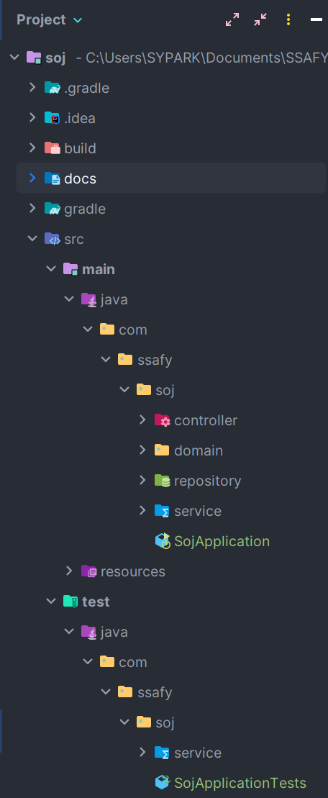
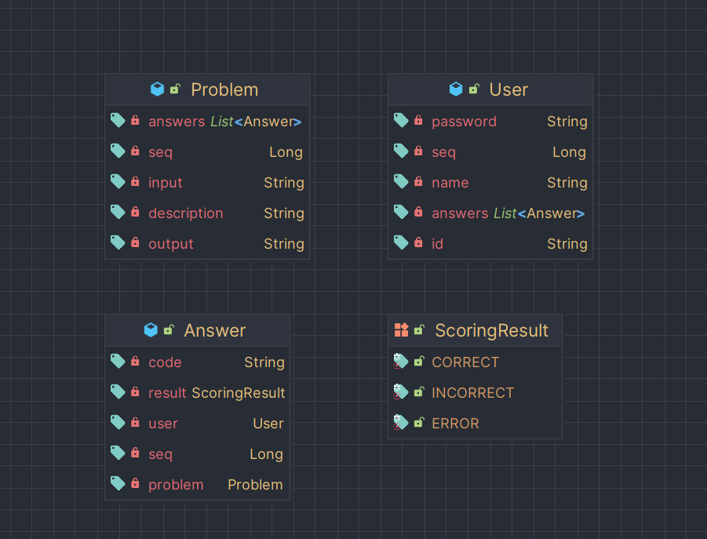
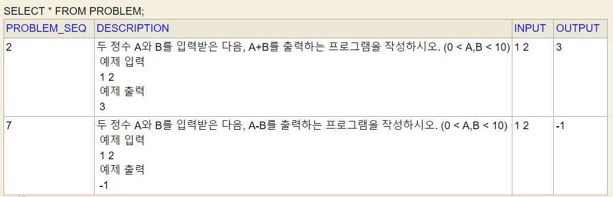
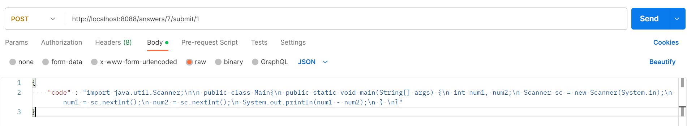
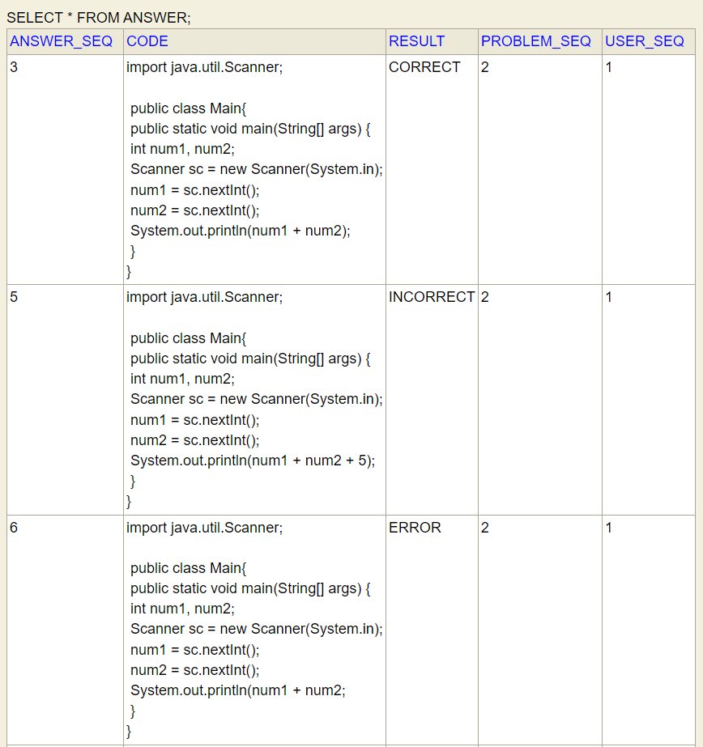

## 코딩테스트 채점 서버 만들기

 

### 기술스택
Java, Spring, Spring JPA, H2 Database, Apache Tomcat, Postman

### 폴더구조

### 클래스 다이어그램

### Req1. API 서버 구현
- REST API 기반의 Spring Boot 서버 구현
- API 목록
  - 회원가입
  - 로그인
  - 문제 등록
  - 답안 제출
  - 답안 목록 확인

 

### Req2. 채점 데이터 프리셋 생성
- 문제 등록 API를 호출할 때 input, output 데이터 프리셋을 같이 보냄
  - 데이터 프리셋 출처: https://www.acmicpc.net/problem/1000
  - 아직까지는 한 개의 INPUT, OUTPUT만 등록 가능
- 추후에 랜덤함수를 통해 생성한 input.txt, output.txt 파일로 프리셋을 구현할 예정

 

 

### Req3. 정답 여부 판별과 채점 모듈 구현
- 답안 제출 API 호출 시, 채점 모듈 구동 후 DB에 저장
- 채점 모듈
  1. 전달받은 String 형태의 소스코드를 `JavaCompiler` 인터페이스를 이용해 동적 컴파일
  2. 메모리에 컴파일 결과인 `.class` 파일을 저장하고, 클래스 로딩 및 main 메소드 실행
  3. main 메소드의 args로 들어갈 값들(input data)을 바이트 배열로 변환 후, Inputstream으로 변환
  4. `System.setIn()` 메소드에 해당 `InputStream`을 넣으면 main 메소드의 args로 해당 입력이 들어가게 됨
  5. 메소드 실행 후의 output값을 데이터 프리셋 output값과 비교 후 결과 반환

 

### Req4. 주어진 제한 시간에 맞는 채점 - 구현 예정

 

### Req5. 상황에 맞는 상태 코드 리턴
- 채점 결과: `CORRECT` - output 일치, `INCORRECT` - output 불일치, `ERROR` - 컴파일 에러

 

### Req6. 정답 데이터를 제출하고 원하는 리턴이 나오는지 검증(심화)
- 문제: 입력으로 주어진 두 수를 더한 결과를 출력하는 문제
- Request Body
  

- 답안제출: 맞았습니다
- 

 

### Plus💡
- 한 문제를 여러 개의 데이터 프리셋 데이터로 채점할 수 있도록
  - 랜덤 프리셋 데이터 생성
- 시간, 메모리 제한 추가
- 순환 참조 에러 해결
